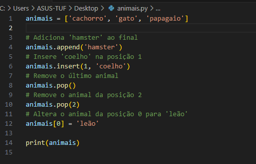
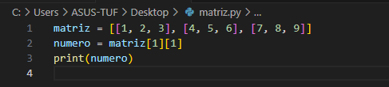
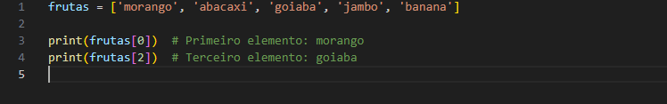
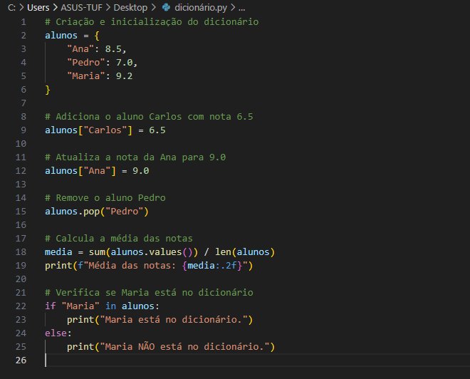

# AT03-Listas_e_Dicionarios
Atividades das aulas de Programação

1) Manipulação da lista animais:
#print(animais)
Resultado: ['leão', 'coelho', 'papagaio']

3) Acessar o número 5 na matriz:
#print(numero)
Saida: 5

5) Comprimento da lista exemplo:
#print(len(exemplo))
Saida: 4

7) Acessar elementos na lista frutas:
#print(frutas[0])
Primeiro elemento: Morango

#print(frutas[2])  
Terceiro elemento: goiaba

Dicionário chamado alunos para armazenar o nome dos alunos e suas respectivas notas.
Saída esperada:
Média das notas: 8.23
Maria está no dicionário.

